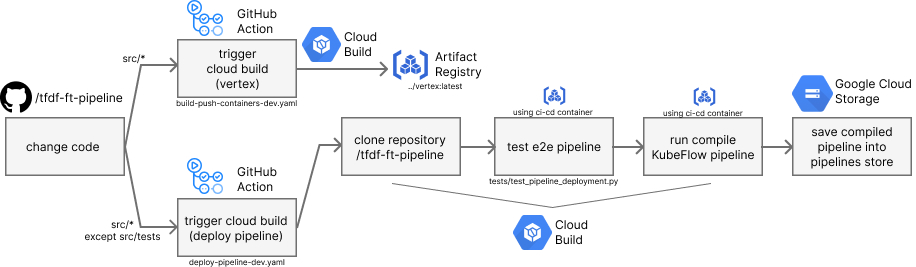
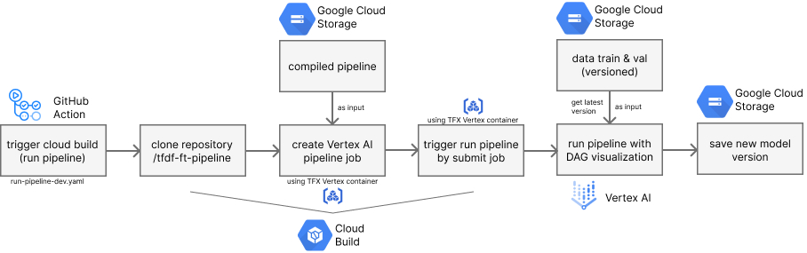
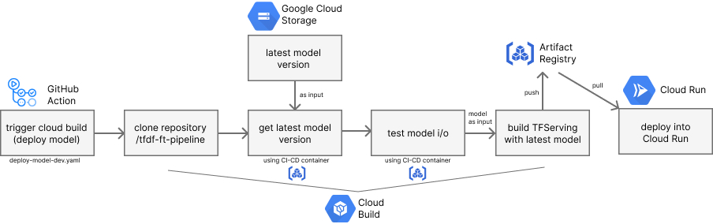
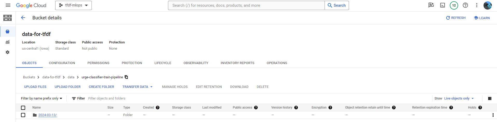
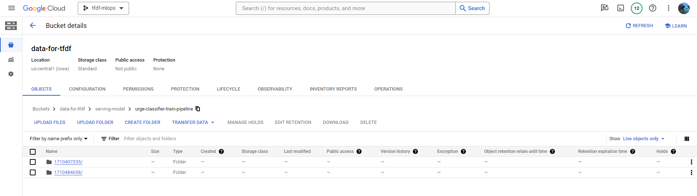
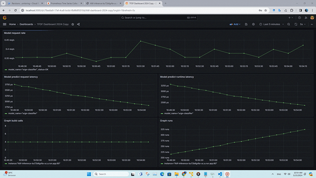

<h1 align="center">TFDF Pipeline</h1>
<div align="center">


</div>
<hr/>

This project demonstrates how to build a machine learning pipeline for training and tuning TFDF on the [ImproveYou](https://github.com/reevald/improveyou/tree/main/mlops) dataset using the technologies of TensorFlow Extended (TFX), TensorFlow Decision Forest (TFDF), Kubeflow, and Vertex AI (GCP).

## Workflow CI-CD & Compile 

<p align="center">
  
</p>

Trigger cloud build `deploy-pipeline-dev.yaml` by making changes in the code or performing an empty commit and include `Deploy Pipeline` in the commit message (or trigger manually in the Action tab). The first step is to clone this repository and then attempt testing the end-to-end pipeline. If the test passes, then compile the Kubeflow pipeline, and the result is a JSON file that needs to be saved into the pipeline store in Google Cloud Storage. This compiled pipeline will be consumed in continuous training below.

## Workflow Continuous Training

<p align="center">
  
</p>

Trigger cloud build `run-pipeline-dev.yaml` by making changes in the code or performing an empty commit and include `Run Pipeline` in the commit message (or trigger manually in the Action tab). Similarly to the previous workflow, the first step is to clone the repository and attempt to retrieve the previously compiled pipeline. This compiled pipeline will be used as input when creating the Vertex AI pipeline job. The job can be executed by submitting it to the Vertex AI service. Once submitted, we can monitor the progress of the running pipeline with Directed Acyclic Graph (DAG) visualization, similar to the animation below.

<p align="center">
  
</p>

Once the process is completed, if the model meets the threshold metrics value, it will produce a new model version that is pushed into Google Cloud Storage.

## Workflow Continuous Model Deployment

<p align="center">
  
</p>

For this workflow, we can trigger it by creating an empty commit with `Deploy Model TFDF` included in the commit message (or triggering it manually in the Action tab). After cloning this repository, it will retrieve the latest model version from Google Cloud Storage. The model should be tested before deployment. If the test passes, the model is ready to be deployed with TFServing and Google Cloud Run. Once deployed, we will receive the endpoint for model inference. To test predictions, we can use `src/tests/test_prediction.ipynb`.

**Note:** To integrate all of the workflows, human in loop is still needed to check the input and output of the current and previous workflows.

## Instruction to Run Pipeline

### Requirements
- Local
    - Installed Git, Python
    - Windows build of TFDF is not maintained at this point ([more info](https://www.tensorflow.org/decision_forests/installation#windows)), we need Linux or MacOS. For windows user, I recommend using Virtual Machine (mine case) or Docker
- Cloud
    - Setup Google Cloud CLI and [Setup ADC](https://cloud.google.com/docs/authentication/provide-credentials-adc)
    - Google Cloud project with active billing

### Local Environment
1. Clone this repository
    ```bash
    git clone https://github.com/reevald/tfdf-ft-pipeline.git
    ```
2. Install dependencies
    ```bash
    # It is recommended to run the following pip command in virtual environment
    $ pip install -r requirements.txt
    ```
3. You can configure with change config variable inside src/tfx_pipelines/config.py. For example enable tuning component.
4. Run local pipeline
    ```bash
    $ python src/local_runner.py
    ```
    Once done, you will get new model inside serving_saved_model.

### Cloud Environment (with Continuous Training)

1. Set up a bucket in Google Cloud Storage and upload data into GCS. This process should be handled by the ETL process, but for now, we can use `src/data_to_gcs.ipynb` to manually upload `sample_local_data`.
2. Enable the related Vertex AI, Artifact Registry API, and Cloud Build API to use these services.
3. To run the pipeline with Vertex AI, we can:
    - Manually submit a job using `src/interactive_run_vertex_ai.ipynb`
    - Automatically (Continuous Training) by triggering GitHub Actions (Compile and Run pipeline). The result can be checked in Google Cloud Storage.
  
    <p align="center">
      
    </p>

## Data Versioning

```
📂data/
└─ 📂urge-classifier-train-pipeline/
   ├─ 📂{year}-{month}-{date}/
   │  └─ 📂ver-{unix-time}/
   │     ├─📂train/
   |     |  └─📄synth_train.csv
   |     └─📂val/
   |        └─📄synth_val.csv
   ├─ 📂...
```

In the ExampleGen, by setting input config like this:
```python
from tfx import v1 as tfx

tfx.proto.Input(
    splits=[
        tfx.proto.Input.Split(
            name="train",
            pattern="{YYYY}-{MM}-{DD}/ver-{VERSION}/train/synth_train.csv",
        ),
        tfx.proto.Input.Split(
            name="val",
            pattern="{YYYY}-{MM}-{DD}/ver-{VERSION}/val/synth_val.csv",
        ),
    ]
)
```

The data should be generated by the ETL process from the data warehouse. Once new data is generated, we can retrieve the latest data version from Google Cloud Storage. ExampleGen in TFX will automatically ingest the latest version of the data. The data should be separated to prevent auto-splitting by ExampleGen. Google Cloud Storage is chosen because it is suitable for saving any data types at scale.

<p align="center">
  
</p>

## Model Versioning

```
📂serving-model/
└─ 📂urge-classifier-train-pipeline/
   ├─ 📂{unix-time}/
   │  ├─ 📂assets/
   │  ├─ 📂variables/
   │  ├─ 📄 fingerprint.pb
   │  ├─ 📄 keras_metadata.pb
   │  └─ 📄 saved_model.pb
   ├─ 📂...
```

TFServing actually has the capability to retrieve the latest model from a list of version models in a single directory. TFServing needs to access all model versions by downloading them first to select the latest version. If the size of the model is relatively large (in GB) and consists of several versions, it will not be efficient to apply in production. `build/utils.py::get_latest_model_version` was created to tackle this problem, and it can even be customized to retrieve a specific model version.

<p align="center">
  
</p>


## Model Performance with Live Monitoring

This monitoring is different from [Vertex AI Model Monitoring](https://cloud.google.com/vertex-ai/docs/model-monitoring/overview). Here, we use Prometheus and Grafana to extract performance metrics from TFServing that has already been deployed. Since the endpoint of TFServing in Cloud Run (with Continuous Model Deployment) is relatively static, we don't need to frequently redeploy the Prometheus service. Hence, we can manually deploy the Prometheus service in Cloud Run using the Gcloud CLI or locally.

- Build and push container into Artifact Registry
  ```bash
  cd monitoring
  gcloud builds submit --config cloudbuild-prometheus.yaml --substitutions _GOOGLE_CLOUD_REGION={region},_DOCKER_REPO_NAME={repo_name}
  ```
- Deploy container into Cloud Run
  ```
  gcloud run deploy tfdf-monitoring --platform managed --region {region} --image {region}-docker.pkg.dev/{project}/{repo_name}/prometheus --allow-unauthenticated
  ```
For Grafana we can use install and use it locally as dashboard that retrieve data from Prometheus service. 

To test monitoring process we can use `src/tests/test_prediction.ipynb` at the last cell to create traffic simulation.

<p align="center">
  
</p>

## Main References
- https://github.com/GoogleCloudPlatform/professional-services/tree/main/examples/vertex_mlops_enterprise

## TODO: Improvements
- [x] Implemented test end-to-end pipeline before compile it.
- [x] Implemented test latest version model artifact before deploy it.
- [ ] Separate ExampleGen between train and test to prevent data leak when transforming data, for example when doing normalization data. (see: [Data Ingestion and Split](https://medium.com/google-cloud/machine-learning-pipeline-development-on-google-cloud-5cba36819058#:~:text=Data%20Ingestion%20and%20Split),
the test only be used in EvaluatorGen) (Coming Soon).
- [ ] Implement Apache Beam (with Google DataFlow) to run data transformation at scale (Coming Soon)
- [ ] PoC continuous training with WarmStart model. Since currently to re-train existing TFDF model, we need to create temporary directory and setting some parameter like try_resume_training, see: [Retrain TFDF Model](https://www.tensorflow.org/decision_forests/api_docs/python/tfdf/keras/GradientBoostedTreesModel#:~:text=If%20true%2C%20the%20model%20training%20resumes%20from%20the%20checkpoint%20stored%20in%20the%20temp_directory%20directory.%20If%20temp_directory%20does%20not%20contain%20any%20model%20checkpoint%2C%20the%20training%20start%20from%20the%20beginning.).
- [ ] [Optional] Experiment inference using Vertex AI endpoint and Cloud Function as public api gateway (current: using TFServing with Cloud Run)