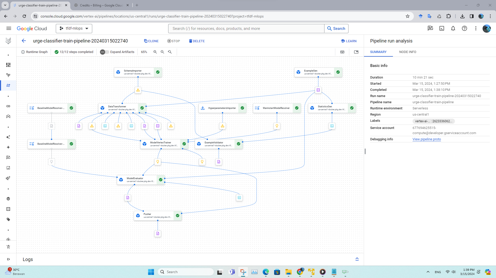

# TFDF Pipeline
This project demonstrates how to build a machine learning pipeline for train and tuning TFDF on [ImproveYou](https://github.com/reevald/improveyou) dataset with the technologies of TensorFlow Extended (TFX), TensorFlow Decision Forest (TFDF), KubeFlow and Vertex AI (GCP).

<p align="center">
  
</p>

## Instruction to Run Pipeline

### Requirements
- Local
    - Installed Git, Python
    - Windows build of TFDF is not maintained at this point ([more info](https://www.tensorflow.org/decision_forests/installation#windows)), we need Linux or MacOS. For windows user, I recommend using Virtual Machine (mine case) or Docker
- Cloud
    - Setup Google Cloud CLI and [Setup ADC](https://cloud.google.com/docs/authentication/provide-credentials-adc)
    - Google Cloud project with active billing

### Local Environment
1. Clone this repository
    ```bash
    git clone https://github.com/reevald/tfdf-ft-pipeline.git
    ```
2. Install dependencies
    ```bash
    # It is recommended to run the following pip command in virtual environment
    $ pip install -r requirements.txt
    ```
3. You can configure with change config variable inside src/tfx_pipelines/config.py. For example enable tuning component.
4. Run local pipeline
    ```bash
    $ python src/local_runner.py
    ```
    Once done, you will get new model inside serving_saved_model.

### Cloud Environment (with Continuous Training)
<p align="center">
  
</p>

1. Setup Bucket in Google Cloud Storage and upload data into GCS, this process should be handled by ETL process, but for now, we can use src/data_to_gcs.ipynb to
upload `sample_local_data` manually.
2. Enable related-Vertex AI, Artifact Registry API and Cloud Build API to use these services.
3. To run pipeline with Vertex AI we can:
    - Manually by submit job with `src/interactive_run_vertex_ai.ipynb`
    - Automatically (Continuous Training) with triggering GitHub Actions (Compile and Run pipeline) the result can be checked in Google Cloud Storage.

## Model Deployment

### Local Deployment
[TODO: add documentation]

### Cloud Deployment (with Continuous Deployment)
[TODO: add documentation]

## Inference
To test inference, we can use `src/tests/test_prediction.ipynb`.
### Local Inference
[TODO: add documentation]
### Cloud Inference

In this case we use TFServing with Google Cloud Run cause more flexible and efficient, if we have multiple model and want to deploy in one service.
[TODO: add documentation]

## Data Versioning
[TODO: add documentation]
<p align="center">
  
</p>

## Model Versioning
[TODO: add documentation]
<p align="center">
  
</p>


## Model Performance with Live Monitoring
[TODO: add documentation]
<p align="center">
  
</p>

## Main References
- https://github.com/GoogleCloudPlatform/professional-services/tree/main/examples/vertex_mlops_enterprise

## TODO: Improvements
- [ ] Separate ExampleGen between train and test to prevent data leak when transforming data, for example when doing normalization data. (see: ,
the test only be used in EvaluatorGen) (Coming Soon)
- [ ] Implement Apache Beam (with Google DataFlow) to run data transformation at scale (Coming Soon)
- [ ] PoC continuous training with WarmStart model. Since currently to re-train existing TFDF model, we need to create temporary directory and setting some parameter like try_resume_training, see:
- [ ] [Optional] Experiment inference using Vertex AI endpoint and Cloud Function as public api gateway (current: using TFServing with Cloud Run)